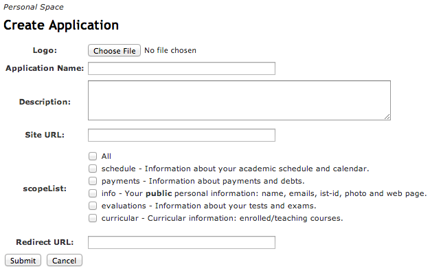
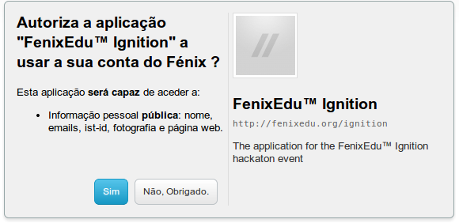

# Técnico API Documentation

Técnico's API exposes core concepts of the FenixEdu platform, such as people, spaces, degrees and courses.
There are currently two versions of the API, v1 and v2, available to be used, with the
latter being still in its beta phase. Both versions are thoroughly documented
in the pages linked in the sidebar, including a list of all the available endpoints and
usage examples.

::: danger
Técnico API v2 is still in beta and existing endpoints are subject to change, or even removal.
All endpoint changes will be published under the changelog page.

Once Técnico API v2 is deemed stable, all changes will preserve backwards compatibility.
:::

<!-- [[_TOC_]] -->

## Use Técnico API in your application

In this tutorial, you will learn how to register your third-party application to use the Técnico API, and
how to use one of the SDKs that we developed to ease the API invocation. Note that you can still use any
HTTP client to invoke the endpoints on your own, or perhaps, contribute with a SDK of your favorite language.

::: warning
The mentioned SDKs are related to FenixEdu API v1, and might not work with Técnico API v2.  
In the future, SDKs for v2 might be released.
:::

### Step 1 - Register your Application

The first thing you need to start using the Técnico API is to register your application within the system
running the FenixEdu™ you wish to invoke. To do so, you must login into FenixEdu™ installation and
select the menu `Personal > Manage Applications`.

To register your third-party application, you'll need to provide some information about your application.
To do this, you need to fill up the form shown in Figure 1.



- **Logo** - A 64x64 pixel-wide image that identifies your application.
- **Application Name** - The name of your application.
- **Description** - A short text about your application.
- **Site URL** - An optional website URL of your application.
- **Scopes** - The private information scopes that users must authorize to use your application.
- **Redirect** URL - - The endpoint in your application to proceed the OAuth2 flow.

This information is used by us to identify your application and allow users to authorize their private data through the oAuth authorization protocol. When using your application for the first time, users will be prompt to authorized the requested scopes. The authorization form, exemplified in Figure 2, will display the information that you provided when your registered your application.



### Step 2 - Invoke the REST API Endpoints

After you registered your application, two important tokens will be given to you:

- **Client ID** - Identifies your application.
- **Client Secret** - The private secret that will be used to sign all your application requests.

#### Step 2.1 - Use one of the official SDKs

In the case your application is developed in Java, PHP or Python, you can easily start invoking the Técnico API using the respective SDK. You can find out how to use them by reading the corresponding tutorial:

- [Java][java-sdk]
- [PHP][php-sdk]
- [Python][python-sdk]

If you still wish to understand the overall flow, or in case you decided not to use one of the available SDKs, you should continue to read the tutorial and understand how to request the user's permission, obtain access tokens, make API requests using such access tokens, or refresh them when they expire.

#### Step 2.2 - Request the User Permission

The first thing your application must do is to obtain authorization from a FenixEdu user. To do this, you application must redirect the user to the authorization form, like the one identified in Figure 2.

```http
https://fenix.tecnico.ulisboa.pt/oauth/userdialog?client_id=<client_id>&redirect_uri=<redirect_uri>
```

This page will prompt the user to authorize your application, so that FenixEdu™ can provide the information you requested when you created your application. If the user is not logged in, FenixEdu™ will ask them to login first before they can authorize your application.

::: tip
Remember that both `client_id` and `redirect_uri` tokens are available in the details of your registered application.
:::

It might be the case that the user refuses to authorize your application. When the user denies authorization to your application, they will be redirected to the following endpoint:

```http
<redirect_uri>?error=access_denied&error_description=User didn't allow the application
```

Unsurprisingly, you can't continue the authorization workflow if the user refuses to authorize your application.

::: tip
If your application is getting many authorization denials, you might be requesting scopes of information that the user finds irrelevant
for your application needs, or they just don't trust you. Either way, you should review the scopes requested by your application,
or give a more detailed explanation to the user why you need such scopes of information before you request their authorization.
:::

#### Step 2.3 - Request the Access Token

After the user authorizes your application, FenixEdu will invoke a `GET` HTTP request in the redirect URL that you specified when you registered your application. In such request, Técnico API will provide a `code` through a query param as exemplified:

```http
<redirect_uri>?code=XXXXXXXXXXX
```

The obtained code must be used to obtain an `access_token` for that user. For that, you must invoke a `POST` HTTP request in the exemplified endpoint:

```http
https://fenix.tecnico.ulisboa.pt/oauth/access_token?client_id=<client_id>&client_secret=<client_secret>&redirect_uri=<redirect_uri>&code=<code>&grant_type=authorization_code
```

If everything is working as intended, an `HTTP 200 Ok` response with `Content-Type: application/json` should be returned with the following body:

```json
{
  "access_token": "IGNhbiBjb252ZXJ0IHRleHRzW5nIHNldmVyYWwgY29kZSBwYWdlcpbmcgQ2hhclNl",
  "refresh_token": "dCBwcm9wZXJ0eSkgZnJvbSBVbmlIHN0cmluZyB0byBieXRlIGFycmZCB0aGVuIGNv",
  "expires_in": "3600"
}
```

#### Step 2.4 - Refresh the Access Token

In the interest of security, every issued access token is only valid for 1 hour. After this period of time, the `access_token` expires and the `refresh_token` must be used to issue a new one. The `refresh_token` never expires, unless:

1. You change your application information.
2. The user explicitly revokes the associated authorization.
3. A Técnico API administrator either revokes the associated authorization or the application.

To get a new `access_token`, you must invoke a `POST` request to the following endpoint:

```http
https://fenix.tecnico.ulisboa.pt/oauth/refresh_token?client_id=<client_id>&client_secret=<client_secret>&refresh_token=<refresh_token>&grant_type=refresh_token
```

If everything goes smoothly, you should receive an `HTTP 200 Ok` response with `Content-Type: application/json` as exemplified:

```json
{ "access_token": "IGNhbiBjb252ZXJ0IHRleHRzIHVIHNldmVym3r2cgQ2hhclNl", "expires_in": "3600" }
```

### Using Spring Security OAuth2

If you are using [Spring Security OAuth2](http://projects.spring.io/spring-security-oauth/docs/oauth2.html) the configuration should be fine-tuned as below due to known limitations of Bennu OAuth2 implementation ([BNN-230](https://jira.fenixedu.org/browse/BNN-230) [BNN-231](https://jira.fenixedu.org/browse/BNN-231))

```yaml
spring:
  oauth2:
    client:
      accessTokenUri: https://localhost:8080/oauth/access_token
      userAuthorizationUri: https://localhost:8080/oauth/userdialog
      clientId: <...>
      clientSecret: <...>
      clientAuthenticationScheme: form
      authenticationScheme: query
```

### Troubleshooting

If something goes wrong while invoking the Técnico API, an `HTTP 401 Unauthorized` response with `Content-Type: application/json` will be returned:

```json
{
  "error": "...",
  "error_description": "..."
}
```

Depending of your action, you can have different error codes that might help you identify your problem:

- Errors while Invoking the API:
  - `invalidScope` - Application doesn't have permissions to access the invoked endpoint.
  - `accessTokenInvalid` - The access token used doesn't match the one in the server.
  - `accessTokenExpired` - The access token has expired. The refresh token must be used to get a new one.
  - `accessTokenInvalidFormat` - The access token used was not recognized.
- Errors while Refreshing the Access Token:
  - `invalid_grant` - Credentials or `redirect_uri` don't match.
  - `refreshTokenInvalid` - Refresh token doesn't match.
  - `refreshTokenInvalidFormat` - Refresh Token not recognized.

[java-sdk]: https://github.com/FenixEdu/fenixedu-java-sdk
[python-sdk]: https://github.com/FenixEdu/fenixedu-python-sdk
[php-sdk]: https://github.com/FenixEdu/fenixedu-php-sdk
